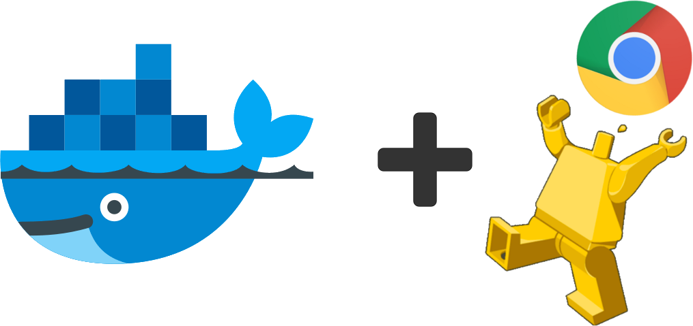

Google Chrome Headless - Docker Image
================================

[](http://github.com/femtopixel/docker-google-chrome-headless/releases)
[](https://hub.docker.com/r/femtopixel/google-chrome-headless/)
[](https://hub.docker.com/r/femtopixel/google-chrome-headless/)
[](https://m.freewallet.org/id/374ad82e/btc)
[](https://m.freewallet.org/id/374ad82e/ltc)
[](https://utip.io/femtopixel)
[](https://www.paypal.me/jaymoulin)
[](https://www.buymeacoffee.com/3Yu8ajd7W)
[](https://patreon.com/femtopixel)

[Google Chrome Headless](https://developers.google.com/web/updates/2017/04/headless-chrome) is the Google Chromium browser that can be started without graphical interface to accomplish several tasks (PDF printing, performance, automation...)

Usage
-----

```
docker run --rm --name chrome -it -p 9222:9222 femtopixel/google-chrome-headless <optional_args> <optional_site_url> 
```

With `<optional_site_url>` url to your site (e.g. http://www.google.com). By default `about:blank`. You can pass args **BEFORE** the `url` if you want to use some.

By default, Chrome Headless listen on the `9222` port but this can be changed by passing the `CHROME_DEBUG_PORT` environment to the value you want.

### Example

```
docker run --rm --name chrome -it -p 9000:9000 -e CHROME_DEBUG_PORT=9000 femtopixel/google-chrome-headless <optional_args> <optional_site_url> 
``` 
